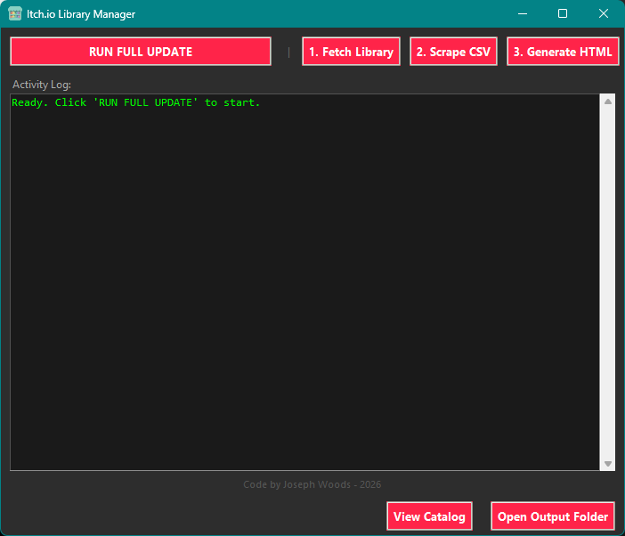
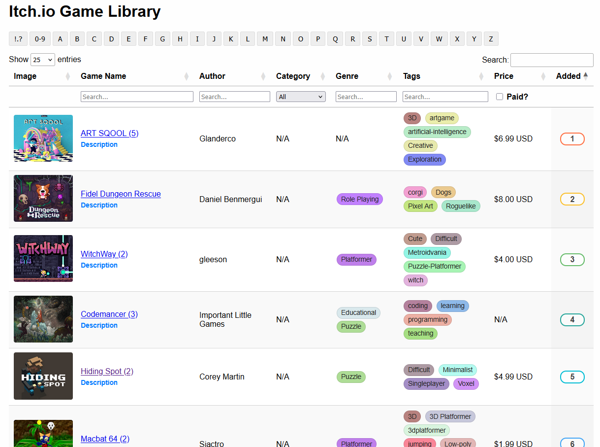
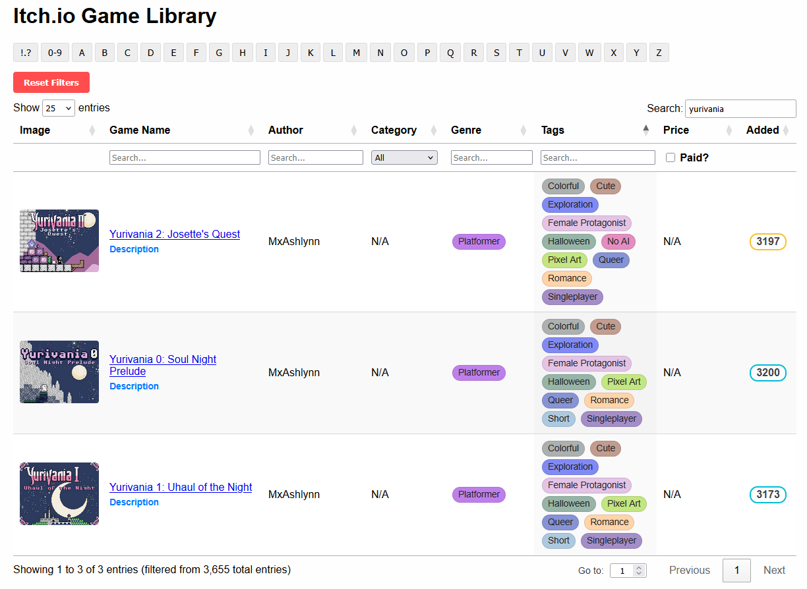
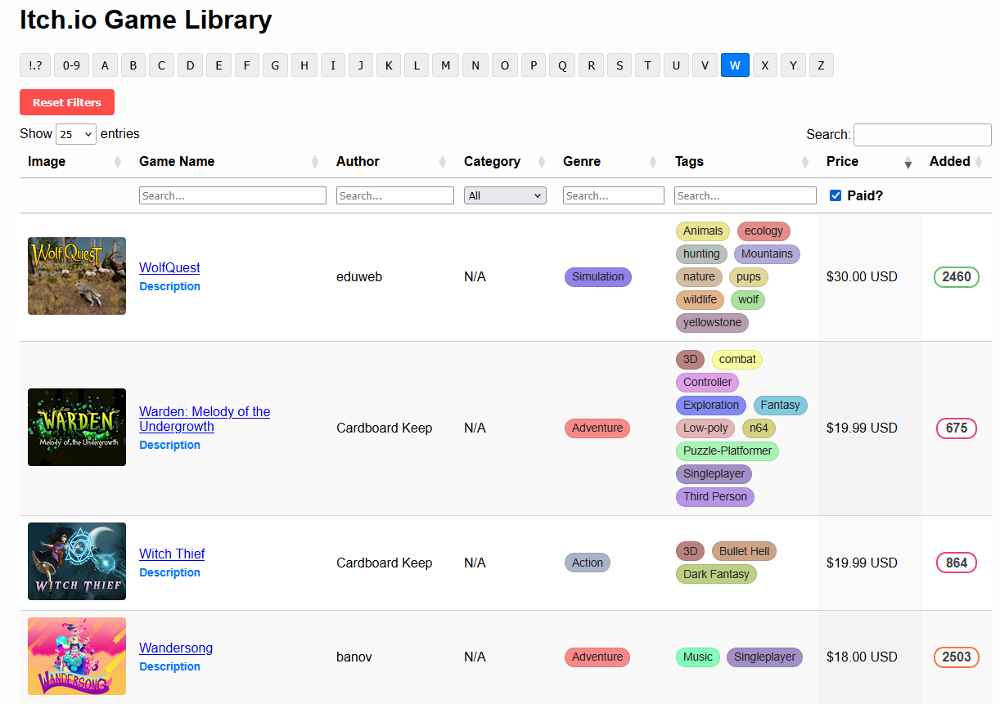

Better-Itch.io-Library (VERSION 2.0)

A better way to browse, sort, and search your purchased and claimed games on Itch.io.

WE ARE BACK! After taking the previous build down to address some security/stability concerns, I've rewritten a lot of the tool from the ground up. Version 2 is faster, smarter, and finally has a proper GUI so you don't have to mess around with command lines if you don't want to.
* What's New in V2?

  * No More Manual Saving: You no longer have to right-click and "Save As..." The new tool opens a browser window, logs you in, and scrolls the library for you automatically.

  * Actual GUI: Added a dark-mode interface that shows you exactly what the scraper is doing in real-time.

  * Smart Updates: The scraper now remembers where it left off. If you buy 5 new games, it won't re-scan your entire 2,000 game library—it just grabs the new stuff.

  * Visual Overhaul:

    * Added "Rainbow Chips" for tags and genres—they are color-coded based on the text so you can spot "Horror" or "TTRPG" at a glance.

    * Added a less obnoxious zoom effect to the thumbnails.

  * Robustness: Fixed the crashing issues with emojis and Japanese characters in game titles.

* Features

  * Offline Library: Generates a single, portable HTML file you can keep anywhere.

  * Deep Search: Filter by Category, Genre, Tags, and Paid/Free status simultaneously.

  * Actually Sortable: So you can view your games in an order other than purchase date

* How to Install & Run
  * Option A: Windows Executable

    * Download the latest .zip from the Releases tab on the right.

    * Extract the folder to your desktop (or wherever you want your library to live).

    * Run ItchLibraryManager.exe.

  * First Run Note: The program will pause for about a minute on the very first launch while it downloads the necessary browser drivers (Chromium) in the background. It might look frozen, just give it a moment!

* Option B: Raw Python (Mac/Linux/Windows)

  * If you prefer running from source or want to modify the code:

  * Clone or download this repository.

  * Open a terminal in the folder and install the dependencies:

  * >pip install requests beautifulsoup4 playwright

    * Important: You need to install the browser binaries for Playwright:

    * >playwright install chromium

  * Run the GUI: python itch_gui.py

* How to Use

  * Click RUN FULL UPDATE.
  
  * A browser window will pop up. Log in to your Itch.io account.

  * The script will take over and scroll to the bottom of your library.

  * Once it's done, check the browser window to make sure it reached the end, then click Yes on the popup.

  * Wait for the Scraper and Generator to finish.

  * Open itch_catalog.html to view your library!

* ToDo / Future Plans for the 3.0 drop

  * Add a "Hide Game" feature for the HTML gallery (for those bundle games you know you'll never play).

  * Add a persistant collections system so you can organize your games into custom groups

  * Intergration with Itch.io Desktop to go straight to a games install screen with the click of a button
